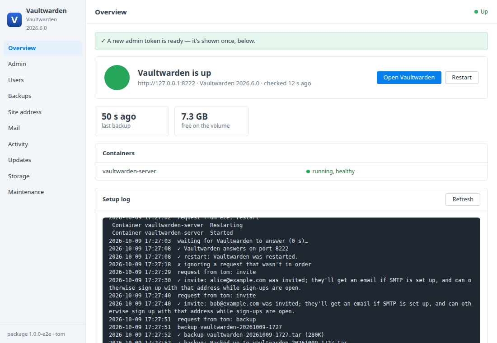
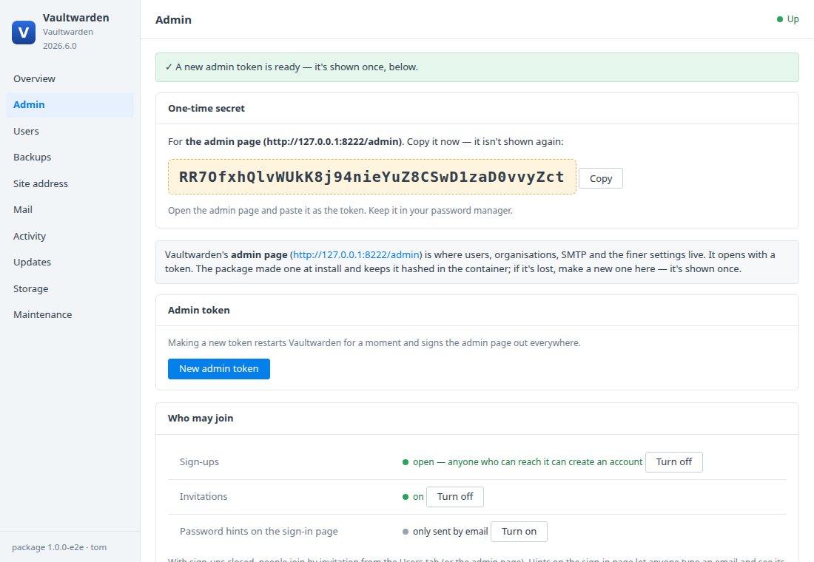
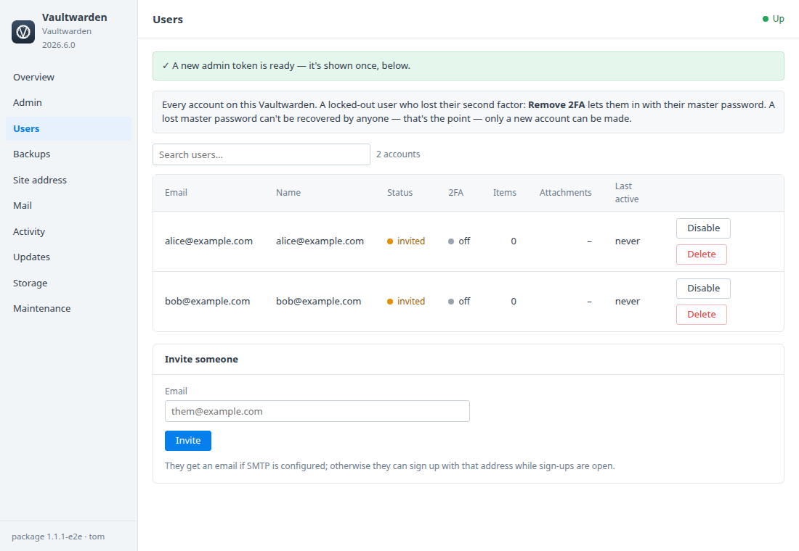
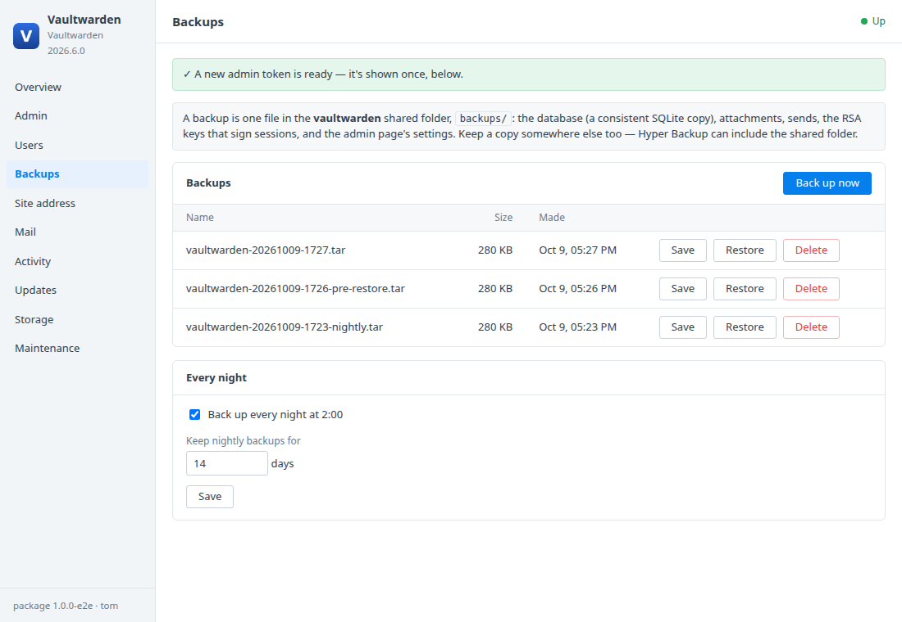
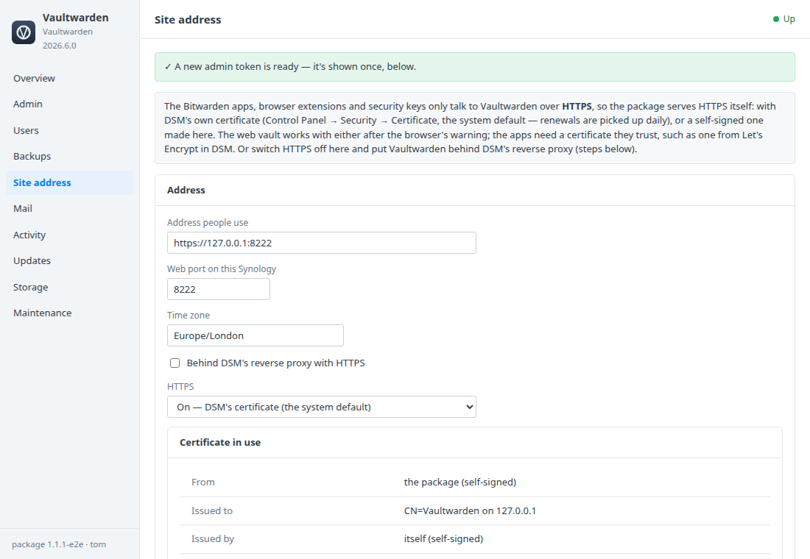
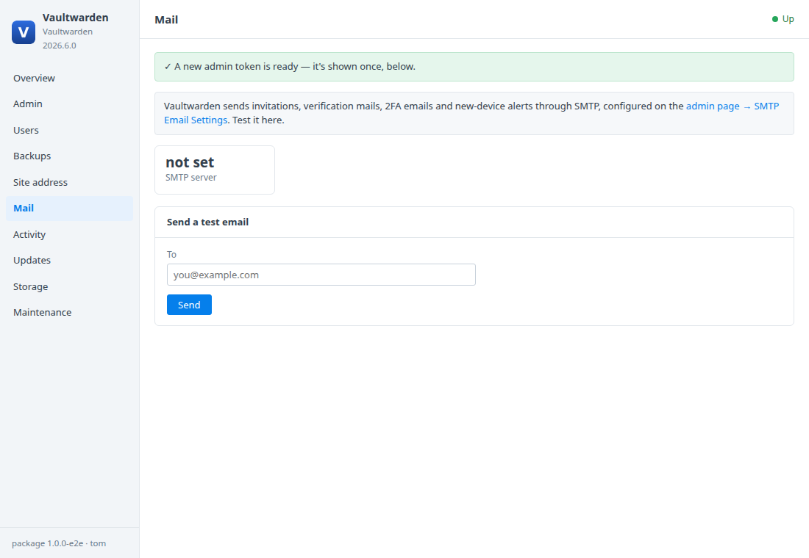
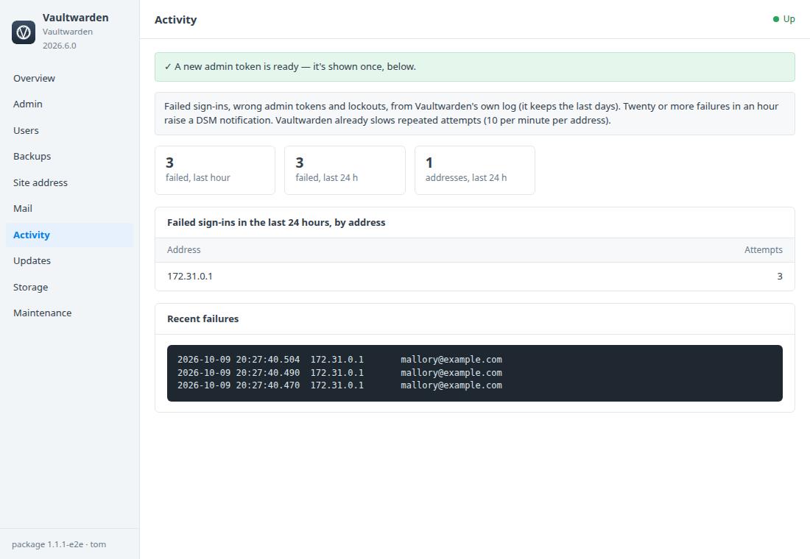
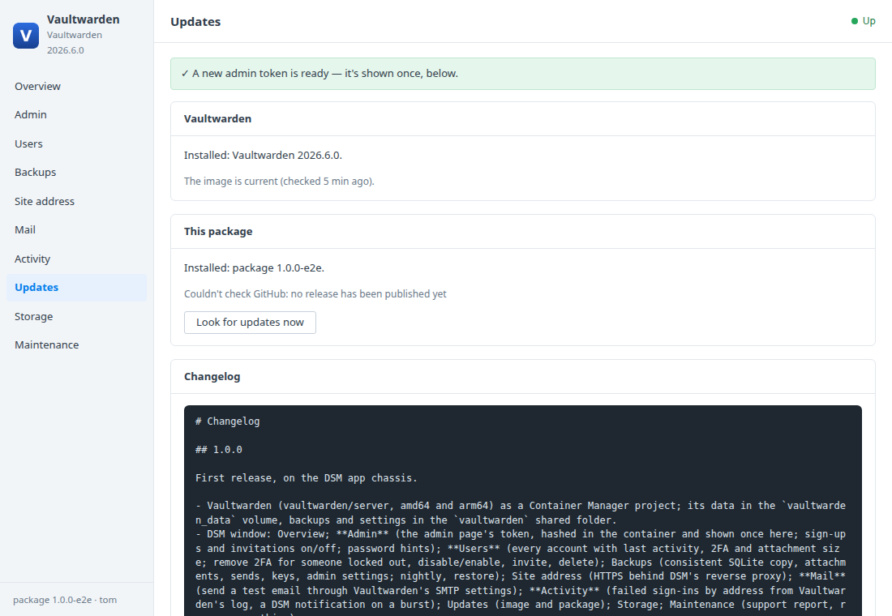
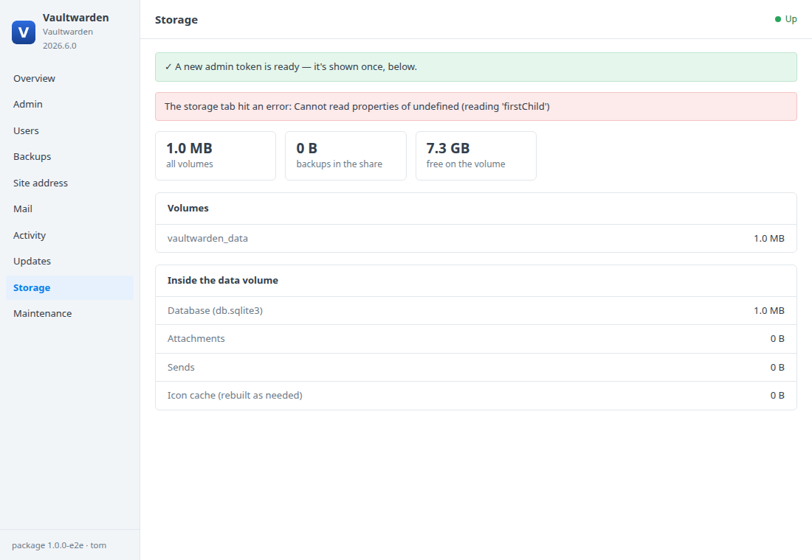
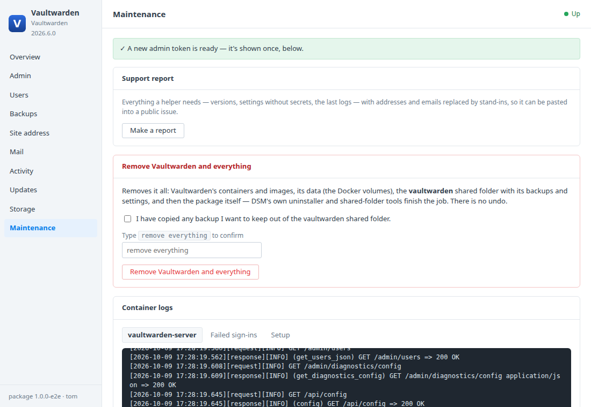

# Vaultwarden for Synology DSM

A DSM 7 package that installs [Vaultwarden](https://github.com/dani-garcia/vaultwarden)
— the lightweight server for the Bitwarden apps — in Container Manager, with a
**Vaultwarden** window in DSM for the things that otherwise need a shell:
the admin token, locked-out users, sign-ups, backups, mail, updates, and a
clean removal. Built on the [DSM app chassis](https://github.com/tombruton87/dsm-app-chassis).

## Download

**[Download vaultwarden-1.0.0-1.spk](https://github.com/tombruton87/vaultwarden-dsm/releases/download/v1.0.0/vaultwarden-1.0.0-1.spk)** — or see [Releases](https://github.com/tombruton87/vaultwarden-dsm/releases/latest) for the newest.
Install: Package Center → Manual Install → the `.spk` (DSM 7.2.1+; Container
Manager is installed first if missing). The wizard asks for the NAS's address,
a port, a time zone and whether sign-ups are open. Then open the address,
create your account, and point the Bitwarden apps at it. For the apps and
browser extensions Vaultwarden must be on HTTPS: the Site address tab has the
DSM reverse-proxy steps.

## The window

| Tab | What it does |
|---|---|
| **Overview** | Is it up, the container, free space, last backup, the setup log; Open, Restart. |
| **Admin** | The admin page's token (made at install, hashed in the container, shown once; make a new one if lost). Sign-ups, invitations and password hints on/off. |
| **Users** | Every account with status, 2FA, items, attachments, last activity. **Remove 2FA** for someone locked out, disable/enable, invite, delete. |
| **Backups** | A consistent SQLite copy plus attachments, sends, keys and admin settings in one tar; nightly, save, restore, retention. |
| **Site address** | URL, port, time zone; HTTPS behind DSM's reverse proxy with the steps. |
| **Mail** | Which SMTP server is set; send a test email. |
| **Activity** | Failed sign-ins by address from Vaultwarden's log; a DSM notification on a burst. |
| **Updates** | A newer Vaultwarden image (backup first) or package, applied from inside DSM. |
| **Storage** | The data volume's parts: database, attachments, sends, icon cache. |
| **Maintenance** | A redacted support report, container logs, and Remove Vaultwarden and everything. |

Administrators can do everything; a DSM user the app is granted to gets a read-only window.

## Screenshots

| | |
|---|---|
|  |  |
|  |  |
|  |  |
|  |  |
|  |  |

## Layout

```
chassis/          the DSM app chassis (git submodule)
package.conf      name, title, services, volumes, images, port, texts
app/compose.yaml  Vaultwarden; data in the vaultwarden_data volume
setup/app.sh      the hooks: admin token (argon2), backups (sqlite3 .backup), admin API, failed sign-ins
ui/               Admin, Users, Mail, Activity tabs; CGI validation of their actions
wizard/           the Accounts page of the install wizard
tests/            steps for the chassis harness
```

Build: `chassis/build.sh . N`. Test: `chassis/tests/e2e.sh . up && chassis/tests/e2e.sh . act` on any Linux box with Docker.
